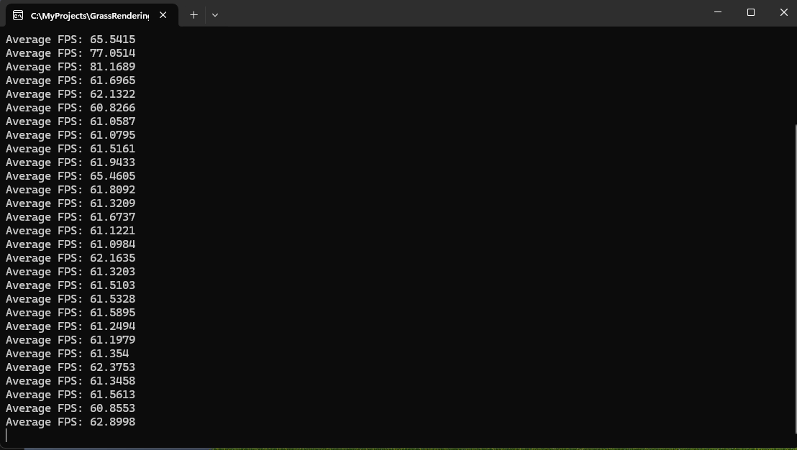

# GrassRendering
This is a project that I created to render multiple grass textures(billboards) with GPU Instancing technique in OpenGL. Currently it is able to generate 30,000 grass textures with an average of 60FPS. Inspired by one of Acerola's youtube videos where he renders grass 

## Prerequisites

- **OpenGL**: Ensure that your system has the latest OpenGL drivers installed.
- **GLFW**: A library for creating windows and managing input. Download it from [GLFW's official website](https://www.glfw.org/).
- **GLAD**: An OpenGL loader generated by the [GLAD tool](https://glad.dav1d.de/).
- **stb_image**: A header-only library for loading images. The `stb_image.h` file is included in the project.

## Installation

1. **Clone the Repository**:
   ```bash
   git clone https://github.com/Virtucious/GrassRendering.git
   cd GrassRendering```

2. **Set Up Dependencies**
   - GLFW: Download and install GLFW. Ensure that the library files are linked appropriately in your development environment.
   - GLAD: The glad.c file is included in the repository. Ensure it's compiled and linked with your project.

3. **Build the project**
   - Using visual studio
     - Open ``GrassRendering.sln``
     - Build the solution
    
## Usage
- Camera controls
  - W: Move Forward
  - S: Move backward
  - A: Move Left
  - D: Move Right
- Mouse movement to look around

## Preview


